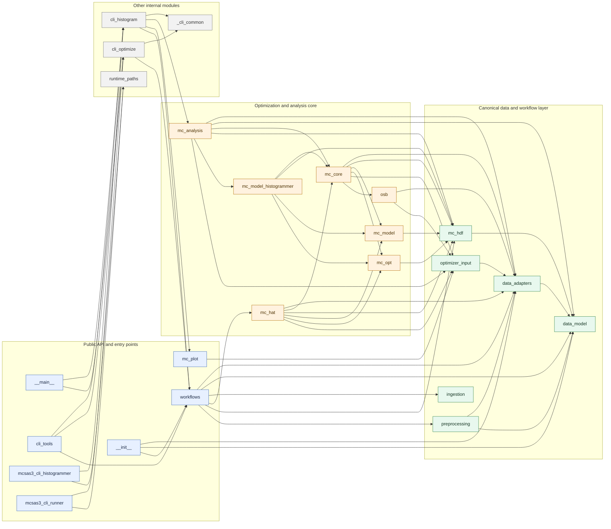

# McSAS3 Module Dependency Diagram

Generated on: 2026-04-01

This file is generated by `python tools/generate_dependency_diagram.py`.
It captures imports between top-level modules in `src/mcsas3` and is intended as a
maintained structure overview rather than a full call graph.



## Regeneration

Run:

```bash
./.venv/bin/python tools/generate_dependency_diagram.py
```

## Notes

- The diagram is generated from import statements, so it shows module coupling rather than runtime call flow.
- External dependencies are intentionally omitted.
- The layer grouping is curated for readability; edges within and across layers remain generated.
